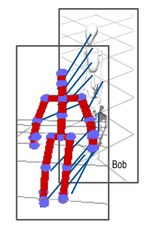
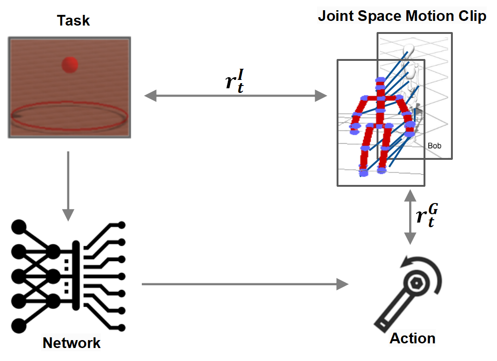
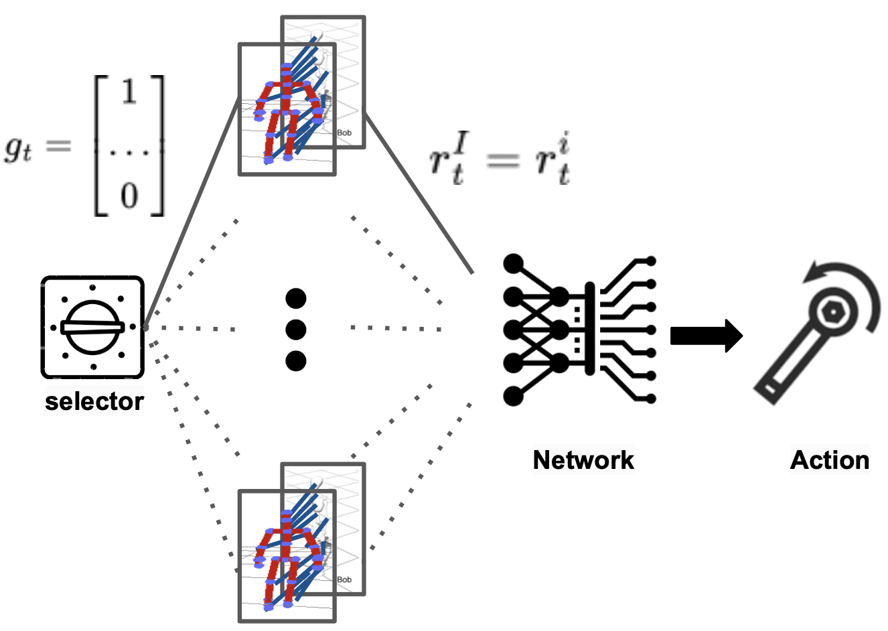
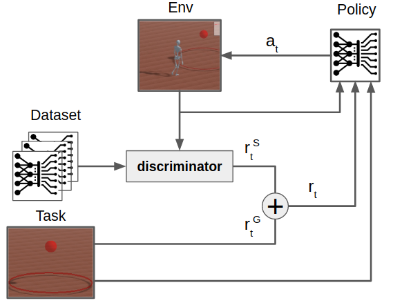
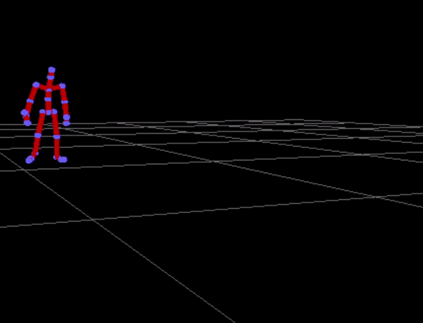
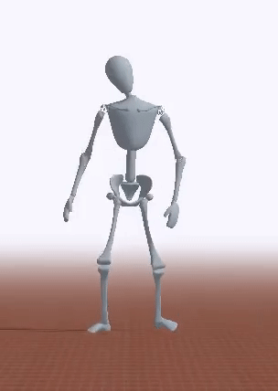
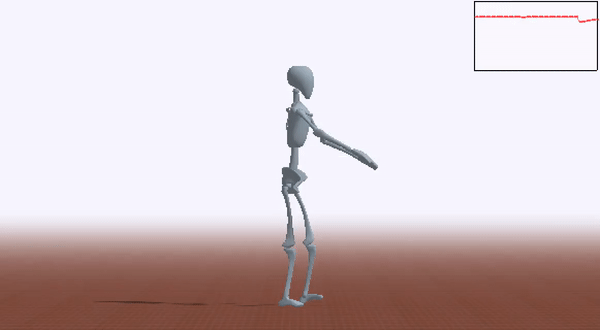

# Intro 
This project aims to solve four specific subtasks by implementing adaptive modifications and improvements to the DeepMimic codebase. 

Project rated with full marks, [report](Report.pdf) available.

The details of these four tasks are as follows:

1. [**Task 1** ](#task-1): Retargeting Motion capture data to the character model 'Bob'.
<p align="center">
   
</p>

2. [**Task 2**](#task-2): Each policy imitate one motion clip.

<p align="center">
   
</p>


3. [**Task 3**](#task-3): Single policy imitate all motion clips based on selection input.

<p align="center">
   
</p>


4. [**Task 4**](#task-4): Single policy imitates motion styles from motion clip database based on tasks using AMP.
<p align="center">
   
</p>

## Dependencies

``sudo apt install libgl1-mesa-dev libx11-dev libxrandr-dev libxi-dev``

``sudo apt install mesa-utils``

``sudo apt install clang``

``sudo apt install cmake``

C++:

- Bullet 2.88 (https://github.com/bulletphysics/bullet3/releases)

  Download Bullet 2.88 from the above link and install using the following commands.
  
	``./build_cmake_pybullet_double.sh``
	
	``cd build_cmake``
	
	``sudo make install``

- Eigen (http://www.eigen.tuxfamily.org/index.php?title=Main_Page) (Version : 3.3.7)

	``mkdir build && cd build``
	
	``cmake ..``
	
	``sudo make install``

- OpenGL >= 3.2
- freeglut (http://freeglut.sourceforge.net/) ( Version : 3.0.0 )

	``cmake .``
	
	``make``
	
	``sudo make install``
  
- glew (http://glew.sourceforge.net/) ( Version : 2.1.0 )

	``make``
	
	``sudo make install``
	
	``make clean``

Misc:

- SWIG (http://www.swig.org/) ( Version : 4.0.0 )

	``./configure --without-pcre``
	
	``make``
	
	``sudo make install``

- MPI 
	- Windows: https://docs.microsoft.com/en-us/message-passing-interface/microsoft-mpi
	- Linux: `sudo apt install libopenmpi-dev`


Python:

- Python 3
- PyOpenGL (http://pyopengl.sourceforge.net/) 

``pip install PyOpenGL PyOpenGL_accelerate``

- Tensorflow (https://www.tensorflow.org/) ( Vesrion : 1.13.1 )

``pip install tensorflow`` 
- MPI4Py (https://mpi4py.readthedocs.io/en/stable/install.html)

``pip install mpi4py``

## Build
The simulated environments are written in C++, and the python wrapper is built using SWIG.
Note that MPI must be installed before MPI4Py. When building Bullet, be sure to disable double precision with the build flag `USE_DOUBLE_PRECISION=OFF`.

### Windows
The wrapper is built using `DeepMimicCore.sln`.

1. Select the `x64` configuration from the configuration manager.

2. Under the project properties for `DeepMimicCore` modify `Additional Include Directories` to specify
	- Bullet source directory
	- Eigen include directory
	- python include directory

3. Modify `Additional Library Directories` to specify
	- Bullet lib directory
	- python lib directory

4. Build `DeepMimicCore` project with the `Release_Swig` configuration and this should
generate `DeepMimicCore.py` in `DeepMimicCore/`.


### Linux
1. Modify the `Makefile` in `DeepMimicCore/` by specifying the following,
	- `EIGEN_DIR`: Eigen include directory
	- `BULLET_INC_DIR`: Bullet source directory
	- `PYTHON_INC`: python include directory
	- `PYTHON_LIB`: python lib directory

2. Build wrapper,
	```
	make python
	```
This should generate `DeepMimicCore.py` in `DeepMimicCore/`

## How to use
### Task 1
Download the BVH files from [this database](http://mocap.cs.sfu.ca/).

``` bash
cd data/prep

# convert all .bvh files located in ./InputBvh/ into Mimic Motion files, located in ./OutputMimic/ .
python example_script.py
```
Or you can also use the mocap data provided by DeepMimic to train the following tasks.
### Task 2
To run the policy presented in the report, use the command
``` bash
python DeepMimic.py --arg_file args/run_humanoid3d_spinkick_args.txt
python DeepMimic.py --arg_file args/run_humanoid3d_cartwheel_args.txt
python DeepMimic.py --arg_file args/run_humanoid3d_backflip_args.txt
python DeepMimic.py --arg_file args/run_strike_humanoid3d_spinkick_args.txt

```
To train:
``` bash
python3 DeepMimic_Optimizer.py --arg_file args/train_amp_strike_humanoid3d_spinkick_args.txt --num_workers 16
```
Note: there could be a segfault when running the policy due to mesh reading errors, but it will run through eventually if you run it for multiple times.


### Task 3
The argument file that defines a skill selector task is almost the same as the one for a single skill imitator, with only the following changes:
``` bash
--kin_ctrl clips					# set to 'clips', which tells the program to learn multiple motions
--motion_file data/datasets/humanoid3d_clips_walks.txt	# a file that points to the motion clips the police should learn
--mean_motion_time 7.5					# average holding time for a single motion clip
--sync_char_root_pos true				# enable synchronization of root position when switching motion clips
--sync_char_root_rot true				# enable synchronization of root rotation when switching motion clips

#IMPORTANT: For one single policy, the motion clips should have the same --fall_contact_bodies
```

To run the policy presented in the report, use the command
``` bash
python DeepMimic.py --arg_file args/run_bob_walks_args.txt
```
To train a skill selector, use `mpi_run.py` and specify an argument file for a skill selector task
``` bash
python mpi_run.py --arg_file args/train_bob_walks_args.txt --num_workers 16
```

### Task 4
To run the policy presented in the report, use the command
``` bash
python DeepMimic.py --arg_file args/run_amp_strike_humanoid3d_walk_punch_args.txt

```
To train:
``` bash
python3 DeepMimic_Optimizer.py --arg_file args/train_amp_strike_humanoid3d_spinkick_args.txt --num_workers 16
```
Note: there could be a segfault when running the policy due to mesh reading errors, but it will run through eventually if you run it for multiple times.

## Results
The visulization of the results in each task show as follows:
1. **Task 1**: 
<p align="center">
   
   
  <figcaption>Visual comparison of the original BVH motion clip depicting a parkour roll on the floor starting from a kneeling position, and the retargeted motion clip applied to Bob.</figcaption>
</p>

2. **Task 2**: 
<p align="center">
   
   
   
   
  <figcaption>Example motions from the trained policies of task 2. Left-to-right: backflip, sideflip, spinkick, and spinkick policy trained to strike a target with the character’s right foot.</figcaption>
</p>

3. **Task 3**: 
<p align="center">
   
  <figcaption>Example motions from the trained policies of task 3. </figcaption>
</p>

4. **Task 4**: 
<p align="center">
   
   
  <figcaption>Example motions from the trained policies of task 4. </figcaption>
</p>

<!-- ## How to Use
Once the python wrapper has been built, training is done entirely in python using Tensorflow.
`DeepMimic.py` runs the visualizer used to view the simulation. Training is done with `mpi_run.py`, 
which uses MPI to parallelize training across multiple processes.

`DeepMimic.py` is run by specifying an argument file that provides the configurations for a scene.
For example,
```
python DeepMimic.py --arg_file args/run_humanoid3d_spinkick_args.txt
```

will run a pre-trained policy for a spinkick. Similarly,
```
python DeepMimic.py --arg_file args/play_motion_humanoid3d_args.txt
```

will load and play a mocap clip. To run a pre-trained policy for a simulated dog, use this command
```
python DeepMimic.py --arg_file args/run_dog3d_pace_args.txt
```

To train a policy, use `mpi_run.py` by specifying an argument file and the number of worker processes.
For example,
```
python mpi_run.py --arg_file args/train_humanoid3d_spinkick_args.txt --num_workers 16
```

will train a policy to perform a spinkick using 16 workers. As training progresses, it will regularly
print out statistics and log them to `output/` along with a `.ckpt` of the latest policy.
It typically takes about 60 millions samples to train one policy, which can take a day
when training with 16 workers. 16 workers is likely the max number of workers that the
framework can support, and it can get overwhelmed if too many workers are used.

A number of argument files are already provided in `args/` for the different skills. 
`train_[something]_args.txt` files are setup for `mpi_run.py` to train a policy, and 
`run_[something]_args.txt` files are setup for `DeepMimic.py` to run one of the pretrained policies.
To run your own policies, take one of the `run_[something]_args.txt` files and specify
the policy you want to run with `--model_file`. Make sure that the reference motion `--motion_file`
corresponds to the motion that your policy was trained for, otherwise the policy will not run properly.

Similarly, to train a policy using amp, run with the corresponding argument files:
```
python mpi_run.py --arg_file args/train_amp_target_humanoid3d_locomotion_args.txt --num_workers 16
```

Pretrained AMP models can be evaluated using:
```
python DeepMimic.py --arg_file args/run_amp_target_humanoid3d_locomotion_args.txt 
```-->

## Interface
- the plot on the top-right shows the predictions of the value function
- right click and drag will pan the camera
- left click and drag will apply a force on the character at a particular location
- scrollwheel will zoom in/out
- pressing 'r' will reset the episode
- pressing 'l' will reload the argument file and rebuild everything
- pressing 'x' will pelt the character with random boxes
- pressing space will pause/resume the simulation
- pressing '>' will step the simulation one step at a time


## Mocap Data
Mocap clips are located in `data/motions/`. To play a clip, first modify 
`args/play_motion_humanoid3d_args.txt` and specify the file to play with
`--motion_file`, then run
```
python DeepMimic.py --arg_file args/play_motion_humanoid3d_args.txt
```

The motion files follow the JSON format. The `"Loop"` field specifies whether or not the motion is cyclic.
`"wrap"` specifies a cyclic motion that will wrap back to the start at the end, while `"none"` specifies an
acyclic motion that will stop once it reaches the end of the motion. Each vector in the `"Frames"` list
specifies a keyframe in the motion. Each frame has the following format:
```
[
	duration of frame in seconds (1D),
	root position (3D),
	root rotation (4D),
	chest rotation (4D),
	neck rotation (4D),
	right hip rotation (4D),
	right knee rotation (1D),
	right ankle rotation (4D),
	right shoulder rotation (4D),
	right elbow rotation (1D),
	left hip rotation (4D),
	left knee rotation (1D),
	left ankle rotation (4D),
	left shoulder rotation (4D),
	left elbow rotation (1D)
]
```

Positions are specified in meters, 3D rotations for spherical joints are specified as quaternions `(w, x, y ,z)`,
and 1D rotations for revolute joints (e.g. knees and elbows) are represented with a scalar rotation in radians. The root
positions and rotations are in world coordinates, but all other joint rotations are in the joint's local coordinates.
To use your own motion clip, convert it to a similar style JSON file.

## Possible Issues and Solutions

ImportError: libGLEW.so.2.1: cannot open shared object file: No such file or directory
search for libGLEW.so.2.1 and use the following command accordingly
ln /path/to/libGLEW.so.2.1 /usr/lib/x86----/libGLEW.so.2.1
ln /path/to/libGLEW.so.2.1.0 /usr/lib/x86----/libGLEW.so.2.1.0

ImportError: libBulletDynamics.so.2.88: cannot open shared object file: No such file or directory
export LD_LIBRARY_PATH=/usr/local/lib/ ( can be temporary when run in terminal) 
(libBullet file are present in that path - gets installed in that path after the command sudo make install while installing Bullet)

## Misc.
- A ROS compatible URDF of the humanoid is available here: https://github.com/EricVoll/amp_motion_conversion

